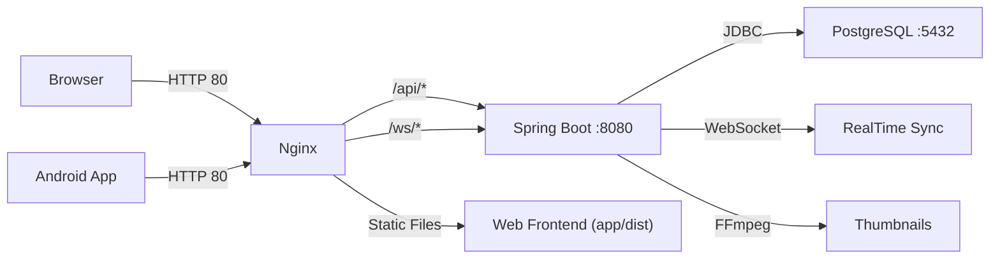

<div align="center">
  
</div>

<p align="center">
  <b>个人云存储系统 — 安全可靠的私有云盘，Web端 + 安卓端</b>
</p>

<p align="center">
  <a href="#-quick-start">Quick Start</a> ·
  <a href="#-features">Features</a> ·
  <a href="#-tech-stack">Tech Stack</a> ·
  <a href="#-development">Development</a> ·
  <a href="#-testing">Testing</a> ·
  <a href="#-deployment">Deployment</a>
</p>

<p align="center">
  
  
  
  
  
  
  
  
  <br/>
  
  
  
</p>

<p align="center">
  <a href="/README.md">🇨🇳 中文</a> ·
  <a href="/README_EN.md">🇬🇧 English</a>
</p>

---

## 📖 Overview

YingmuQiu-nas 是一款功能完整的**个人云存储系统**，支持 Web 端和安卓端访问。上传、管理、预览文件，随时随地存取你的数据。

基于 Java 17 + Spring Boot 3 构建后端，React 18 + TypeScript 驱动前端，React Native + Expo 提供移动端体验，一键 Docker 部署到云服务器。

> **最新动态**：已完成资深开发者全面代码审查，修复了 17 个 Bug/安全问题，代码质量经系统评估后优化。

---

## ✨ Features

| Phase | Capability | Status |
|-------|-----------|:------:|
| 1 | 文件管理、用户认证（JWT）、回收站、文件搜索 | ✅ |
| 2 | 图片预览、视频播放、音频播放、缩略图、照片墙 | ✅ |
| 3 | 安卓端 App（React Native + Expo） | ✅ |
| 4 | 分享链接（密码/有效期/下载次数）、WebSocket 多设备同步 | ✅ |
| 5 | Docker 部署、Nginx 反代、PostgreSQL、全链路 UTF-8 | ✅ |

### What YingmuQiu-nas Provides

| Feature | Description |
|---------|-------------|
| 🗂️ 文件管理 | 上传、下载、搜索、重命名、移动、批量操作 |
| 🖼️ 媒体预览 | 图片/视频/音频播放、EXIF 信息、照片墙时间线 |
| ♻️ 回收站 | 软删除保护、一键恢复、永久删除（含递归子节点清理） |
| 🔗 分享链接 | 密码保护、有效期控制、下载次数限制、客户端IP绑定验证 |
| 🔄 实时同步 | WebSocket 多设备文件变更推送，带指数退避重连 |
| 📱 移动端 | React Native App，文件浏览 + 媒体查看 + 缩略图 |
| 🚀 一键部署 | Docker Compose 部署到任意云服务器 |
| 🔐 安全防护 | JWT 认证、登录频率限制、路径穿越防护、全链路 UTF-8、CORS 策略、生产环境禁用 Swagger |

### 🛡️ 安全特性

- **JWT 令牌认证** — 24 小时有效期，支持 URL 参数传递（媒体播放场景）
- **登录频率限制** — 同 IP 5 次失败后锁定 15 分钟
- **分享频率限制** — 公开分享接口每分钟最多 30 次请求
- **分享密码验证令牌绑定客户端IP** — 防止验证令牌被截获复用
- **路径遍历防护** — 所有文件路径经过 `normalize()` 检查
- **文件扩展名黑名单** — 阻止上传可执行文件（exe/sh/bat 等）
- **SHA-256 文件指纹** — 上传时计算，支持去重
- **Nginx 安全头** — X-Content-Type-Options / X-Frame-Options / CSP
- **生产环境限制** — Swagger 文档和 H2 Console 仅开发环境可用

---

## 🚀 Quick Start

```bash
# 一键部署到云服务器（Ubuntu 22.04+）
ssh root@your-server
curl -sSL https://raw.githubusercontent.com/qiuyingmu/YingmuQiu-nas/main/deploy/deploy.sh | bash
```

> **环境要求**：Docker 24+、Docker Compose v2、2C4G 以上服务器

### Local Docker

```bash
git clone https://github.com/qiuyingmu/YingmuQiu-nas.git
cd YingmuQiu-nas
cp deploy/.env.example .env
# 编辑 .env，填入 JWT_SECRET 和 DB_PASSWORD
docker compose -f deploy/docker-compose.yml --env-file .env up -d
```

完成：访问 `http://your-server-ip` 开始使用

---

## 🔧 Tech Stack

```
Backend      │  Java 17 · Spring Boot 3.3 · PostgreSQL 16 · H2 (dev)
             │  Spring Security · JWT (jjwt 0.12.6) · JPA/Hibernate
             │  WebSocket · Thumbnailator · metadata-extractor · FFmpeg
             │  SpringDoc OpenAPI (dev only)
─────────────┼─────────────────────────────────────────────────
Web Frontend │  React 18 · TypeScript · Vite 5 · Ant Design 5
             │  Tailwind CSS 3 · Zustand 4 · Axios · dayjs
             │  React Router 6 · WebSocket API
─────────────┼─────────────────────────────────────────────────
Mobile       │  React Native 0.76 · Expo SDK 52
             │  React Navigation 7 · expo-image · expo-video
             │  AsyncStorage · Axios
─────────────┼─────────────────────────────────────────────────
Deploy       │  Docker · Nginx · Docker Compose · FFmpeg
             │  GitHub Actions (EAS Build)
```

---

## 💻 Development

### Prerequisites

- JDK 17+ & Maven 3.9+
- Node.js 18+
- Optional: Android Studio (for mobile)

### Set JWT Secret

```bash
# 开发环境需要设置 JWT_SECRET 环境变量
# Windows (CMD):
set JWT_SECRET=your-base64-encoded-secret-here

# Windows (PowerShell):
$env:JWT_SECRET="your-base64-encoded-secret-here"

# Linux/Mac:
export JWT_SECRET=your-base64-encoded-secret-here

# 或直接使用 start.bat（已内置默认 dev 密钥）
```

### Backend

```bash
cd backend
mvn clean package -DskipTests
java -jar target/nas-backend-1.0.0.jar --spring.profiles.active=dev
# API: http://localhost:8080
```

### Web Frontend

```bash
cd web
npm install
npm run dev
# 访问 http://localhost:3000
# WebSocket 通过 Vite 代理自动连接后端
```

### Mobile

```bash
cd mobile
npm install
npx expo start
# 用 Expo Go App 扫码运行
# 连接前需在 App 设置中配置服务器地址
```

---

## 🧪 Testing

```powershell
# 启动后端服务后，运行集成测试
powershell -ExecutionPolicy Bypass -File integration-test.ps1
```

覆盖范围：注册/登录/JWT 认证/文件 CRUD/搜索/回收站/媒体/用户隔离/边缘用例

---

## 📦 Deployment

生产环境部署使用 Docker Compose，详见 [部署指南](./DEPLOY.md)。

```bash
# 完整部署流程
ssh root@your-server

# 安装 Docker
curl -fsSL https://get.docker.com | bash

# 部署
curl -sSL https://raw.githubusercontent.com/qiuyingmu/YingmuQiu-nas/main/deploy/deploy.sh | bash
```

### Architecture



---

## 📊 Code Quality

项目已完成资深开发者全面代码审查，修复了 **17 个问题**：

| Severity | Count | Description |
|:--------:|:-----:|-------------|
| 🔴 P0 | 5 | 致命 Bug（AudioPlayer 崩溃、回收站孤儿数据、分享验证丢失等） |
| 🟠 P1 | 10 | 严重问题（CORS 限制、编译兼容性、移动端缩略图、安全配置等） |
| 🟡 P2 | 2 | 改进建议（脚本优化、容错处理） |

**审查范围**：47 个后端 Java 源文件、21 个 Web 前端文件、7 个 Mobile 源文件、Docker/Nginx/部署脚本

---

## 👥 Community

| | |
|:-:|:-:|
| **Author** | [@qiuyingmu](https://github.com/qiuyingmu) |
| **License** | MIT |
| **Server** | 阿里云 ECS (Docker 26.1.3) |

---

> **💡 Tip**: 首次登录后建议使用注册功能创建账号，默认 10GB 存储空间。

<div align="center">
  
</div>
