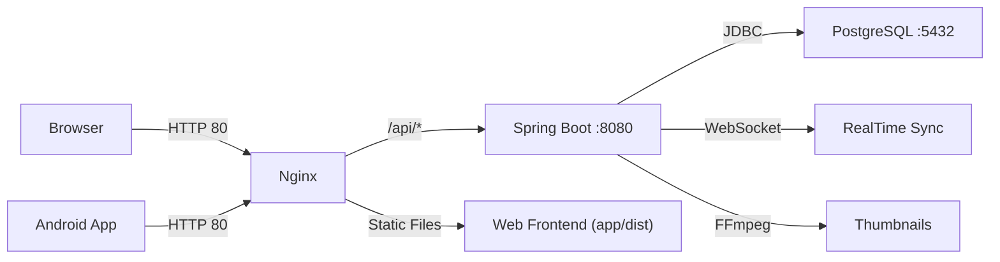

<div align="center">
  
</div>

<p align="center">
  <b>个人云存储系统 — 安全可靠的私有云盘，Web端 + 安卓端</b>
</p>

<p align="center">
  <a href="#-quick-start">Quick Start</a> ·
  <a href="#-features">Features</a> ·
  <a href="#-tech-stack">Tech Stack</a> ·
  <a href="#-development">Development</a> ·
  <a href="#-testing">Testing</a> ·
  <a href="#-deployment">Deployment</a>
</p>

<p align="center">
  
  
  
  
  
  
</p>

<p align="center">
  <a href="/README.md">🇨🇳 中文</a> ·
  <a href="/README_EN.md">🇬🇧 English</a>
</p>

---

## 📖 Overview

YingmuQiu-nas 是一款功能完整的**个人云存储系统**，支持 Web 端和安卓端访问。上传、管理、预览文件，随时随地存取你的数据。

基于 Java 17 + Spring Boot 3 构建后端，React 18 + TypeScript 驱动前端，一键 Docker 部署到云服务器。

---

## ✨ Features

| Phase | Capability | Status |
|-------|-----------|:------:|
| 1 | 文件管理、用户认证（JWT）、回收站、文件搜索 | ✅ |
| 2 | 图片预览、视频播放、音频播放、缩略图、照片墙 | ✅ |
| 3 | 安卓端 App（React Native + Expo） | ✅ |
| 4 | 分享链接（密码/有效期/下载次数）、WebSocket 多设备同步 | ✅ |
| 5 | Docker 部署、Nginx 反代、PostgreSQL、全链路 UTF-8 | ✅ |

### What YingmuQiu-nas Provides

| Feature | Description |
|---------|-------------|
| 🗂️ 文件管理 | 上传、下载、搜索、重命名、移动、批量操作 |
| 🖼️ 媒体预览 | 图片/视频/音频播放、EXIF 信息、照片墙时间线 |
| ♻️ 回收站 | 软删除保护、一键恢复、永久删除 |
| 🔗 分享链接 | 密码保护、有效期控制、下载次数限制 |
| 🔄 实时同步 | WebSocket 多设备文件变更推送 |
| 📱 移动端 | React Native App，文件浏览 + 媒体查看 |
| 🚀 一键部署 | Docker Compose 部署到任意云服务器 |
| 🔐 安全防护 | 登录频率限制、路径穿越防护、全链路 UTF-8 |

---

## 🚀 Quick Start

```bash
# 一键部署到云服务器（Ubuntu 22.04+）
ssh root@your-server
curl -sSL https://raw.githubusercontent.com/qiuyingmu/YingmuQiu-nas/main/deploy/deploy.sh | bash
```

> **环境要求**：Docker 24+、Docker Compose v2、2C4G 以上服务器

### Local Docker

```bash
git clone https://github.com/qiuyingmu/YingmuQiu-nas.git
cd YingmuQiu-nas
cp deploy/.env.example .env
# 编辑 .env，填入 JWT_SECRET 和 DB_PASSWORD
docker compose -f deploy/docker-compose.yml --env-file .env up -d
```

完成：访问 `http://your-server-ip` 开始使用

---

## 🔧 Tech Stack

```
Backend      │  Java 17 · Spring Boot 3.3 · PostgreSQL 16 · H2
             │  Spring Security · JWT (jjwt 0.12.6) · JPA/Hibernate
             │  WebSocket · Thumbnailator · metadata-extractor
─────────────┼─────────────────────────────────────────────────
Web Frontend │  React 18 · TypeScript · Vite 5 · Ant Design 5
             │  Tailwind CSS 3 · Zustand · Axios · dayjs
─────────────┼─────────────────────────────────────────────────
Mobile       │  React Native 0.76 · Expo SDK 52
             │  React Navigation 7 · expo-image · expo-video
─────────────┼─────────────────────────────────────────────────
Deploy       │  Docker · Nginx · Docker Compose · FFmpeg
```

---

## 💻 Development

### Prerequisites

- JDK 17+ & Maven 3.9+
- Node.js 18+
- Optional: Android Studio (for mobile)

### Backend

```bash
cd backend
mvn clean package -DskipTests
java -jar target/nas-backend-1.0.0.jar --spring.profiles.active=dev
# Swagger API: http://localhost:8080/swagger-ui.html
```

### Web Frontend

```bash
cd web
npm install
npm run dev
# 访问 http://localhost:3000
```

### Mobile

```bash
cd mobile
npm install
npx expo start
# 用 Expo Go App 扫码运行
```

---

## 🧪 Testing

```powershell
# 启动后端服务后，运行集成测试
powershell -ExecutionPolicy Bypass -File integration-test.ps1
```

覆盖范围：注册/登录/JWT 认证/文件 CRUD/搜索/回收站/媒体/用户隔离

---

## 📦 Deployment

生产环境部署使用 Docker Compose，详见 [部署指南](./DEPLOY.md)。

```bash
# 完整部署流程
ssh root@your-server

# 安装 Docker
curl -fsSL https://get.docker.com | bash

# 部署
curl -sSL https://raw.githubusercontent.com/qiuyingmu/YingmuQiu-nas/main/deploy/deploy.sh | bash
```

### Architecture



---

## 👥 Community

| | |
|:-:|:-:|
| **Author** | [@qiuyingmu](https://github.com/qiuyingmu) |
| **License** | MIT |

---

> **💡 Tip**: 首次登录后建议使用注册功能创建账号，默认无限制存储配额。

<div align="center">
  
</div>
